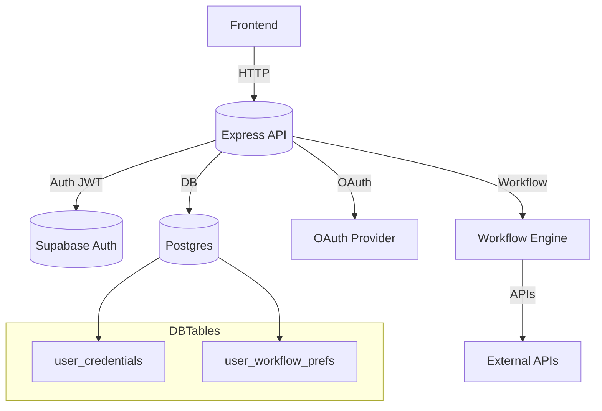
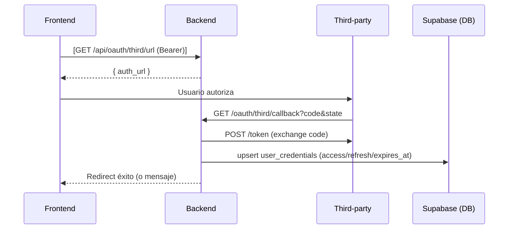
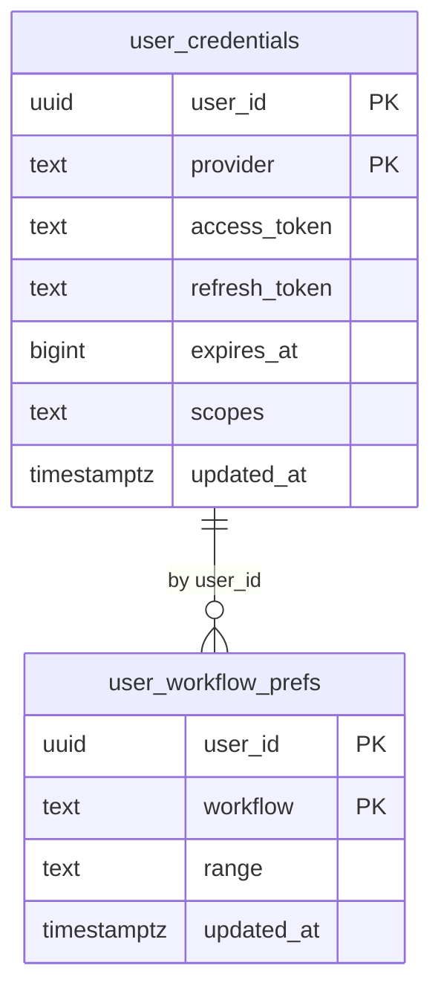

# Nexus AutoMate Backend (invoice-processor)

Backend en Node.js/Express para ejecutar _workflows_ con autenticación de usuarios. Incluye _endpoints_ para preferencias para ejecutar _workflows_ .

## Tabla de contenidos

- **[Resumen](#resumen)**
- **[Arquitectura](#arquitectura)**
- **[Diagramas](#diagramas)**
- **[Endpoints](#endpoints)**
- **[Variables de entorno](#variables-de-entorno)**
- **[Estructura del proyecto](#estructura-del-proyecto)**
- **[Instalación y ejecución](#instalación-y-ejecución)**
- **[Documentación OpenAPI/Swagger](#documentación-openapiswagger)**
- **[Verificación](#verificación)**
- **[Flujos principales](#flujos-principales)**
- **[Esquema de base de datos](#esquema-de-base-de-datos)**
- **[Seguridad](#seguridad)**
- **[Errores comunes](#errores-comunes)**
- **[Notas y próximos pasos](#notas-y-próximos-pasos)**

## Resumen

- **Stack:** Node.js 18+, Express 4, Axios, Helmet, CORS, _express-rate-limit_, _jsonwebtoken_.
- **Propósito:**
  - Ejecutar _workflows_ .
- **Estado:** Rutas principales operativas. Rate _limiting_ y _headers_ de seguridad listos (algunos desactivados por defecto). Diagrama y documentación incluidos.

## Arquitectura

- **Express API** expone `/api/*` protegido por JWT de Supabase (Bearer).
- **Supabase**:
  - Auth: validación del _token_ con `supabase.auth.getUser(token)`.
  - DB: tablas `user_credentials` (_tokens_ de aplicaciones de terceros) y `user_workflow_prefs` (preferencias por usuario/_workflow_).
- **Middlewares**: `authenticateToken`, `attachDemoClient`, `demoRateLimit` (_rate limit_), `helmet`, `cors`, `morgan` (usa logger Winston) para _logs_.

## Diagramas

### Arquitectura (alto nivel)



### Secuencia: Conexión Google OAuth



### Secuencia: Ejecutar workflow de facturas


### ERD (tablas principales)



## Endpoints

Base URL local: `http://localhost:3000`

- **Salud**
  - `GET /health` (público)
  - Respuesta: `{ status: 'ok', message, timestamp }`

- **Auth de aplicación (Supabase)**
  - `POST /api/auth/register` (público)
    - Body: `{ email, password, name }`
    - Crea el usuario en Supabase (_email_ confirmado).
  - `POST /api/auth/login` (público)
    - Body: `{ email, password }`
    - Respuesta: `{ user, access_token, refresh_token }`

- **Google OAuth**
  - `GET /api/oauth/google/url` (protegido)
    - Devuelve `auth_url` para el usuario autenticado.
  - `GET /oauth/google/callback` (público)
    - Intercambia `code` por _tokens_ y guarda en `user_credentials`.
    - Redirige si existen `OAUTH_SUCCESS_REDIRECT` / `OAUTH_FAIL_REDIRECT`.
  - `GET /api/oauth/google/status` (protegido)
    - `{ connected: boolean }` si hay _token_ disponible/refrescable.

- **Workflows**
  - `GET /api/workflows` (protegido)
    - Lista _workflows_ disponibles para el usuario. Devuelve, por workflow: `key`, `name`, `description`, `requires`, `connected`, `prefs` y `actions` (si corresponde). No expone _tokens_. Incluye si tiene Google conectado y preferencias del workflow de facturas.

- **Preferencias (workflow de facturas)**
  - `GET /api/invoice/prefs` (protegido)
    - Respuesta: `{ ... } | { nulls }`
  - `POST /api/invoice/prefs` (protegido)
    - Body: `{ ... }`
    - Upsert en `user_workflow_prefs` para `workflow = 'invoice'`.

- **Ejecución de workflow de facturas**
  - `POST /api/process-invoice` (protegido)
    - Headers reenviados a n8n: `X-Demo-Token` (opcional), `Content-Type: application/json`.
    - Toma el body o, si faltan, de `user_workflow_prefs`.
    - Adjunta `google_access_token` del usuario.
    - Forward a `N8N_WEBHOOK_URL`.
    - Errores:
      - `412 GOOGLE_NOT_CONNECTED` si no hay conexión con Google.
      - `502 WEBHOOK_*` para problemas con automatizaciones.

- **Demo (experimental)**
  - `POST /api/demo/create` (público)
    - Crea un demo token y devuelve _workflows_ disponibles. Pensado para experimentación con `N8nClient`.
  - `POST /api/execute-workflow` y `GET /api/client-info` (protegidos)
    - Integración con `WFClient` basada en un `req.client` (ver Nota 2).

> Nota: Las rutas de **demo** (`execute-workflow`, `client-info`) usan `attachDemoClient` para poblar `req.client` desde `X-Demo-Token` o, en su defecto, desde `req.user`.

## Variables de entorno

Mínimas recomendadas:

```bash
# Servidor
PORT=3000
NODE_ENV=development
# Logging
LOG_LEVEL=info

# Supabase
SUPABASE_URL=...
SUPABASE_SERVICE_ROLE_KEY=...

# JWT del backend (para state OAuth / demo)
JWT_SECRET=change-me
DEMO_JWT_SECRET=change-me

# Google OAuth
GOOGLE_CLIENT_ID=...
GOOGLE_CLIENT_SECRET=...
# Opcional: si no se define se usa {BASE_URL}/oauth/google/callback
GOOGLE_REDIRECT_URI=https://tu-backend.com/oauth/google/callback

# Redirecciones post OAuth (opcionales)
OAUTH_SUCCESS_REDIRECT=https://tu-front.com/success
OAUTH_FAIL_REDIRECT=https://tu-front.com/fail

# n8n
N8N_WEBHOOK_URL=https://.../webhook/demo/social-media    # usado por /api/process-invoice
N8N_WEBHOOK_BASE_URL=https://.../webhook                  # usado por N8nClient
DEMO_TOKEN_SOCIAL=...
DEMO_TOKEN_OCR=...
DEMO_TOKEN_CONTRACTS=...
DEMO_TOKEN_LEADS=...

# Rate limiting (opcionales)
RATE_LIMIT_WINDOW_MS=900000
RATE_LIMIT_MAX_REQUESTS=100
```

Permisos de CORS: en producción está permitido `https://consulor-ia.web.app`; en desarrollo `*`.

## Estructura del proyecto

```text
src/
  app.js                      # Bootstrap Express y rutas
  config.js                   # PORT,  NODE_ENV
  config/security.js          # apiLimiter, securityHeaders, validateContentType
  controllers/
    auth.js                   # Register/Login via Supabase
    workflows.js              # Demo: createDemoAccess/executeWorkflow/getClientInfo
  middleware/
    auth.js                   # authenticateToken (Supabase), attachDemoClient, generateDemoToken
    rateLimit.js              # demoRateLimit por cliente
    logger.js                 # Logger central Winston
  routes/
    invoice.routes.js         # /process-invoice, /invoice/prefs
    oauth.routes.js           # /api/oauth/google/url, /oauth/google/callback, /api/oauth/google/status
    workflows.routes.js       # /api/workflows
    protected.js              # Ejemplo de ruta protegida genérica
  services/
    googleOAuth.js           # buildAuthUrl, exchangeCode, getUserAccessToken
    preferences.js            
  utils/
    n8nClient.js             # Ejecutor de workflows demo (por tipo)
```

## Instalación y ejecución

1. Clonar repo y crear `.env` con las variables de entorno.

1. Instalar dependencias:

```bash
npm install
```

1. Ejecutar en desarrollo:

```bash
npm run dev
```

1. Producción:

```bash
npm start
```

Health check: `GET /health`

## Verificación

- **Ejecutar contra server ya levantado**:
  - `npm run verify`
  - Env soportadas:
    - `BASE_URL` (por defecto `http://localhost:${PORT||3000}`)
    - `TEST_ACCESS_TOKEN` o `TEST_EMAIL`/`TEST_PASSWORD` para rutas protegidas
    - `SKIP_DB=1` para saltar checks dependientes de DB (por defecto en verify:start)
    - `VERIFY_RATELIMIT=1` para probar 429
    - `TEST_WRITE=1` para probar POST `/api/invoice/prefs`
- **Arrancar y verificar en un puerto temporal**:
  - `npm run verify:start` (usa `VERIFY_PORT=3456` por defecto)

## Documentación OpenAPI/Swagger

- **UI**: `GET /docs`
- **JSON**: `GET /openapi.json`
- **Especificación fuente**: `docs/openapi.yaml`

Para modificar o extender la documentación, edita `docs/openapi.yaml`. La app carga el YAML al iniciar y sirve Swagger UI en `/docs`.

### Ejemplos (fetch)

```ts
// Guardar preferencias
await fetch('/api/invoice/prefs', {
  method: 'POST',
  headers: {
    'Content-Type': 'application/json',
    Authorization: `Bearer ${accessToken}`,
  },
  body: JSON.stringify({
    drive_folder_id: 'FOLDER_ID_DE_GOOGLE_DRIVE',
    spreadsheet_id: 'SPREADSHEET_ID',
    range: 'Hoja1!A1:D1',
  }),
});

// Ejecutar workflow (usa body o prefs guardadas)
await fetch('/api/process-invoice', {
  method: 'POST',
  headers: {
    'Content-Type': 'application/json',
    Authorization: `Bearer ${accessToken}`,
    'X-Demo-Token': DEMO_TOKEN, // opcional
  },
  body: JSON.stringify({
    platform: 'twitter',
    content: 'test'
  }),
});
```

## Esquema de base de datos

SQL recomendado para tablas usadas por el _backend_:

```sql
create table if not exists public.user_credentials (
  user_id uuid not null,
  provider text not null,
  access_token text,
  refresh_token text,
  expires_at bigint,
  scopes text,
  updated_at timestamptz default now(),
  primary key (user_id, provider)
);

create table if not exists public.user_workflow_prefs (
  user_id uuid not null,
  workflow text not null,
  drive_folder_id text,
  spreadsheet_id text,
  range text,
  updated_at timestamptz default now(),
  primary key (user_id, workflow)
);
```

## Seguridad

- **Autenticación**: Bearer token de Supabase para `/api/*`.
- **Rate limit**: `demoRateLimit` por `client.id` (si no, por IP). Ajustable vía variables.
- **Headers**: `helmet` aplicado; `securityHeaders` disponible en `config/security.js`.
- **CORS**: producción restringido a `https://consulor-ia.web.app`, dev `*`.

## Errores comunes

- `MISSING_TOKEN` / `INVALID_TOKEN`: falta o _token_ inválido de Supabase.
- `GOOGLE_NOT_CONNECTED` (412): el usuario no conectó Google.
- `WEBHOOK_NO_RESPONSE` / `WEBHOOK_RESPONSE_ERROR` / `WEBHOOK_REQUEST_FAILED`: problemas al llamar al _webhook_.
- `Rate limit exceeded (429)`: excedido el límite configurado.

## Notas y próximos pasos

- `POST /api/auth/register` y `POST /api/auth/login` son públicos por diseño.
- Las rutas de demo usan `attachDemoClient` que inyecta `req.client` (`{ id, type, workflows, createdAt, expiresAt }`).
