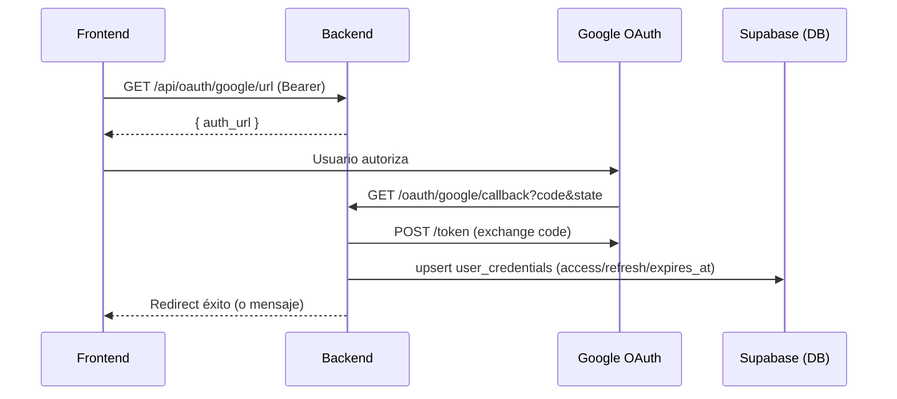
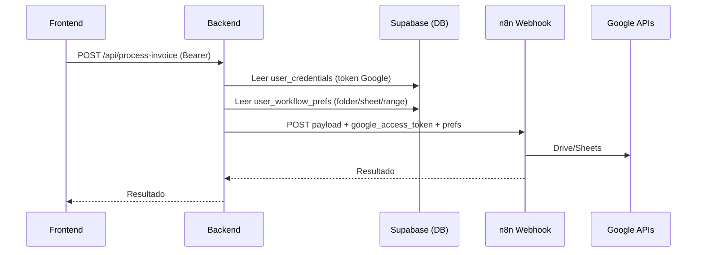
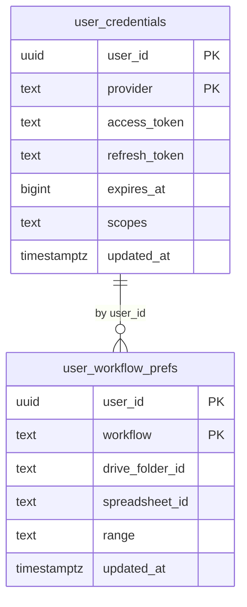

# Nexus AutoMate Backend (invoice-processor)

Backend en Node.js/Express para ejecutar workflows de n8n con autenticación de usuarios vía Supabase y conexión OAuth de Google. Incluye endpoints para preferencias por usuario (carpeta de Drive, hoja y rango de Sheets), reenvío de payloads a n8n y utilidades para listar workflows disponibles.

## Tabla de contenidos

- **[Resumen](#resumen)**
- **[Arquitectura](#arquitectura)**
- **[Diagramas](#diagramas)**
- **[Endpoints](#endpoints)**
- **[Variables de entorno](#variables-de-entorno)**
- **[Estructura del proyecto](#estructura-del-proyecto)**
- **[Instalación y ejecución](#instalación-y-ejecución)**
- **[Documentación OpenAPI/Swagger](#documentación-openapiswagger)**
- **[Flujos principales](#flujos-principales)**
- **[Esquema de base de datos](#esquema-de-base-de-datos)**
- **[Seguridad](#seguridad)**
- **[Errores comunes](#errores-comunes)**
- **[Notas y próximos pasos](#notas-y-próximos-pasos)**

## Resumen

- **Stack:** Node.js 18+, Express 4, Supabase (Auth + Postgres), n8n, Axios, Helmet, CORS, express-rate-limit, jsonwebtoken.
- **Propósito:**
  - Conectar usuarios mediante Supabase Auth.
  - Conectar la cuenta de Google del usuario (OAuth) y guardar tokens en Supabase.
  - Ejecutar workflows de n8n reenviando el `google_access_token` y las preferencias del usuario (Drive/Sheets).
- **Estado:** Rutas principales operativas. Rate limiting y headers de seguridad listos (algunos desactivados por defecto). Diagrama y documentación incluidos.

## Arquitectura

- **Express API** expone `/api/*` protegido por JWT de Supabase (Bearer), más un `GET /health` público.
- **Supabase**:
  - Auth: validación del token con `supabase.auth.getUser(token)`.
  - DB: tablas `user_credentials` (tokens de Google) y `user_workflow_prefs` (preferencias por usuario/workflow).
- **Google OAuth**: intercambio de código por tokens y refresco automático si expiran.
- **n8n**: recepción del payload con token de Google y preferencias; el workflow llama Drive/Sheets.
- **Middlewares**: `authenticateToken` (Supabase), `demoRateLimit` (rate limit), `helmet`, `cors`, `morgan` para logs.

## Diagramas

### Arquitectura (alto nivel)

```mermaid
flowchart LR
    FE[Frontend / Postman] -->|HTTP| API[(Express API)]
    API -->|Auth (JWT)| SUPA[(Supabase Auth)]
    API -->|DB| DB[(Supabase Postgres)]
    API -->|OAuth| GOOGLE[Google OAuth 2.0]
    API -->|Webhook JSON| N8N[n8n Webhook]
    N8N -->|APIs| GAPIs[Google Drive / Google Sheets]

    subgraph DBTables
      UC[user_credentials]
      UWP[user_workflow_prefs]
    end

    DB --> UC
    DB --> UWP
```

### Secuencia: Conexión Google OAuth



### Secuencia: Ejecutar workflow de facturas



### ERD (tablas principales)



## Endpoints

Base URL local: `http://localhost:3000`

- **Salud**
  - `GET /health` (público)
  - Respuesta: `{ status: 'ok', message, timestamp }`

- **Auth de aplicación (Supabase)**
  - `POST /api/auth/register` (ver Nota 1)
    - Body: `{ email, password, name }`
    - Crea el usuario en Supabase (email confirmado).
  - `POST /api/auth/login` (ver Nota 1)
    - Body: `{ email, password }`
    - Respuesta: `{ user, access_token, refresh_token }`

- **Google OAuth**
  - `GET /api/oauth/google/url` (protegido)
    - Devuelve `auth_url` de Google para el usuario autenticado.
  - `GET /oauth/google/callback` (público)
    - Intercambia `code` por tokens, y los guarda en `user_credentials`.
    - Redirige si existen `OAUTH_SUCCESS_REDIRECT` / `OAUTH_FAIL_REDIRECT`.
  - `GET /api/oauth/google/status` (protegido)
    - `{ connected: boolean }` si hay token disponible/refrescable.

- **Workflows**
  - `GET /api/workflows` (protegido)
    - Lista workflows disponibles para el usuario. Incluye si tiene Google conectado y sus preferencias del workflow de facturas.

- **Preferencias (workflow de facturas)**
  - `GET /api/invoice/prefs` (protegido)
    - Respuesta: `{ drive_folder_id, spreadsheet_id, range } | { nulls }`
  - `POST /api/invoice/prefs` (protegido)
    - Body: `{ drive_folder_id?, spreadsheet_id?, range? }`
    - Upsert en `user_workflow_prefs` para `workflow = 'invoice'`.

- **Ejecución de workflow de facturas**
  - `POST /api/process-invoice` (protegido)
    - Headers reenviados a n8n: `X-Demo-Token` (opcional), `Content-Type: application/json`.
    - Toma `drive_folder_id`, `spreadsheet_id`, `range` del body o, si faltan, de `user_workflow_prefs`.
    - Adjunta `google_access_token` del usuario.
    - Forward a `N8N_WEBHOOK_URL` o (por defecto) `https://n8n-service-la6u.onrender.com/webhook/demo/social-media`.
    - Errores:
      - `412 GOOGLE_NOT_CONNECTED` si no hay conexión Google.
      - `502 WEBHOOK_*` para problemas con n8n.

- **Demo (experimental)**
  - `POST /api/demo/create` (público)
    - Crea un demo token y devuelve workflows disponibles. Pensado para experimentación con `N8nClient`.
  - `POST /api/execute-workflow` y `GET /api/client-info` (protegidos)
    - Integración con `N8nClient` basada en un `req.client` (ver Nota 2).

> Nota 1: Por el middleware global `authenticateToken` aplicado a `/api/*`, en la configuración actual estos endpoints también requieren token. Si necesitas exponerlos públicos, mueve estas rutas fuera de `/api` o exclúyelas del middleware.
> Nota 2: Las rutas de demo (`execute-workflow`, `client-info`) esperan `req.client`; no existe un middleware actual que lo inyecte desde el demo token. Considéralo al usarlas o agrega el middleware correspondiente.

## Variables de entorno

Mínimas recomendadas:

```bash
# Servidor
PORT=3000
NODE_ENV=development

# Supabase
SUPABASE_URL=...
SUPABASE_SERVICE_ROLE_KEY=...

# JWT del backend (para state OAuth / demo)
JWT_SECRET=change-me
DEMO_JWT_SECRET=change-me

# Google OAuth
GOOGLE_CLIENT_ID=...
GOOGLE_CLIENT_SECRET=...
# Opcional: si no se define, se usa {BASE_URL}/oauth/google/callback
GOOGLE_REDIRECT_URI=https://tu-backend.com/oauth/google/callback

# Redirecciones post OAuth (opcionales)
OAUTH_SUCCESS_REDIRECT=https://tu-front.com/success
OAUTH_FAIL_REDIRECT=https://tu-front.com/fail

# n8n
N8N_WEBHOOK_URL=https://.../webhook/demo/social-media    # usado por /api/process-invoice
N8N_WEBHOOK_BASE_URL=https://.../webhook                  # usado por N8nClient
DEMO_TOKEN_SOCIAL=...
DEMO_TOKEN_OCR=...
DEMO_TOKEN_CONTRACTS=...
DEMO_TOKEN_LEADS=...

# Rate limiting (opcionales)
RATE_LIMIT_WINDOW_MS=900000
RATE_LIMIT_MAX_REQUESTS=100
```

Permisos de CORS: en producción está permitido `https://consulor-ia.web.app`; en desarrollo `*`.

## Estructura del proyecto

```text
src/
  app.js                      # Bootstrap Express y rutas
  config.js                   # PORT, N8N_WEBHOOK_URL, NODE_ENV
  config/security.js          # apiLimiter, securityHeaders, validateContentType
  controllers/
    auth.js                   # Register/Login via Supabase
    workflows.js              # Demo: createDemoAccess/executeWorkflow/getClientInfo
  middleware/
    auth.js                   # authenticateToken (Supabase), generateDemoToken
    rateLimit.js              # demoRateLimit por cliente
  routes/
    invoice.routes.js         # /process-invoice, /invoice/prefs
    oauth.routes.js           # /api/oauth/google/* y /oauth/google/callback
    workflows.routes.js       # /api/workflows
    protected.js              # Ejemplo de ruta protegida genérica
  services/
    googleOAuth.js            # buildAuthUrl, exchangeCode, getUserAccessToken
    preferences.js            # getInvoicePrefs, upsertInvoicePrefs
  utils/
    n8nClient.js              # Ejecutor de workflows demo (por tipo)
```

## Instalación y ejecución

1. Clonar repo y crear `.env` con las variables de entorno.

1. Instalar dependencias:

```bash
npm install
```

1. Ejecutar en desarrollo:

```bash
npm run dev
```

1. Producción:

```bash
npm start
```

Health check: `GET /health`

## Documentación OpenAPI/Swagger

- **UI**: `GET /docs`
- **JSON**: `GET /openapi.json`
- **Especificación fuente**: `docs/openapi.yaml`

Para modificar o extender la documentación, edita `docs/openapi.yaml`. La app carga el YAML al iniciar y sirve Swagger UI en `/docs`.

## Flujos principales

- **Conectar Google**
  1. `GET /api/oauth/google/url` (Bearer) → devuelve `auth_url`.
  2. Redirigir al usuario a `auth_url`.
  3. Google redirige a `GET /oauth/google/callback?code&state`.
  4. Se guardan tokens en `user_credentials`. `GET /api/oauth/google/status` → `{ connected: true }`.

- **Configurar preferencias**
  - `POST /api/invoice/prefs` (Bearer) con `{ drive_folder_id, spreadsheet_id, range }`.
  - `GET /api/invoice/prefs` para leerlas.

- **Ejecutar workflow de facturas**
  - `POST /api/process-invoice` (Bearer) con el payload de tu caso de uso.
  - El backend adjunta `google_access_token` y completa campos faltantes con preferencias guardadas.
  - Reenvía a n8n (`N8N_WEBHOOK_URL`). n8n llama Drive/Sheets.

### Ejemplos (fetch)

```ts
// Guardar preferencias
await fetch('/api/invoice/prefs', {
  method: 'POST',
  headers: {
    'Content-Type': 'application/json',
    Authorization: `Bearer ${accessToken}`,
  },
  body: JSON.stringify({
    drive_folder_id: 'FOLDER_ID_DE_GOOGLE_DRIVE',
    spreadsheet_id: 'SPREADSHEET_ID',
    range: 'Hoja1!A1:D1',
  }),
});

// Ejecutar workflow (usa body o prefs guardadas)
await fetch('/api/process-invoice', {
  method: 'POST',
  headers: {
    'Content-Type': 'application/json',
    Authorization: `Bearer ${accessToken}`,
    'X-Demo-Token': DEMO_TOKEN, // opcional
  },
  body: JSON.stringify({
    platform: 'twitter',
    content: 'test'
  }),
});
```

## Esquema de base de datos

SQL recomendado para tablas usadas por el backend:

```sql
create table if not exists public.user_credentials (
  user_id uuid not null,
  provider text not null,
  access_token text,
  refresh_token text,
  expires_at bigint,
  scopes text,
  updated_at timestamptz default now(),
  primary key (user_id, provider)
);

create table if not exists public.user_workflow_prefs (
  user_id uuid not null,
  workflow text not null,
  drive_folder_id text,
  spreadsheet_id text,
  range text,
  updated_at timestamptz default now(),
  primary key (user_id, workflow)
);
```

## Seguridad

- **Autenticación**: Bearer token de Supabase para `/api/*`.
- **Rate limit**: `demoRateLimit` por `client.id` (si no, por IP). Ajustable vía variables.
- **Headers**: `helmet` aplicado; `securityHeaders` disponible en `config/security.js`.
- **CORS**: producción restringido a `https://consulor-ia.web.app`, dev `*`.

## Errores comunes

- `MISSING_TOKEN` / `INVALID_TOKEN`: falta o token inválido de Supabase.
- `GOOGLE_NOT_CONNECTED` (412): el usuario no conectó Google.
- `WEBHOOK_NO_RESPONSE` / `WEBHOOK_RESPONSE_ERROR` / `WEBHOOK_REQUEST_FAILED`: problemas al llamar al webhook de n8n.
- `Rate limit exceeded (429)`: excedido el límite configurado.

## Notas y próximos pasos

- Si deseas que `POST /api/auth/register` y `POST /api/auth/login` sean públicos, muévelos fuera del prefijo `/api` o exclúyelos del middleware global de autenticación.
- Para habilitar rutas de demo (`/api/execute-workflow`, `/api/client-info`): agrega un middleware que valide el demo token (`DEMO_JWT_SECRET`) e inyecte `req.client` con `{ id, type, workflows, createdAt, expiresAt }`.
- Considera exportar un OpenAPI/Swagger para contratos.
